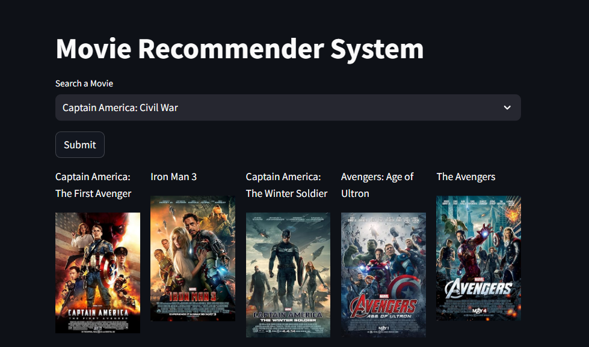

# Movie Recommendation System

## Introduction
The Movie Recommendation System is an innovative tool designed to suggest movies based on user preferences and viewing history. This project utilizes various algorithms and techniques to provide accurate and personalized movie recommendations.

## Features
- Retrieve and display movie recommendations based on user input.
- Analyze user preferences to improve recommendation accuracy.
- Provide detailed information about recommended movies, including genres, ratings, and descriptions.

## Screenshots

### Movie Recommendation Interface


### Movie Details Page


## Important Notice
Due to the recent ban on The Movie Database (TMDB) in India, we are currently unable to provide visualizations through movie images. This limitation may affect the overall user experience, particularly in displaying movie posters and related graphics.

We are exploring alternative sources and solutions to enhance the visualization aspect of our project. Your understanding and support during this time are greatly appreciated.

Thank you for your patience!

## Installation

To get started with this project, clone the repository and install the required dependencies:

```bash
git clone https://github.com/nikitbisht/movie-recommendation-system.git
cd movie-recommendation-system
pip install -r requirements.txt
streamlit run app.py
